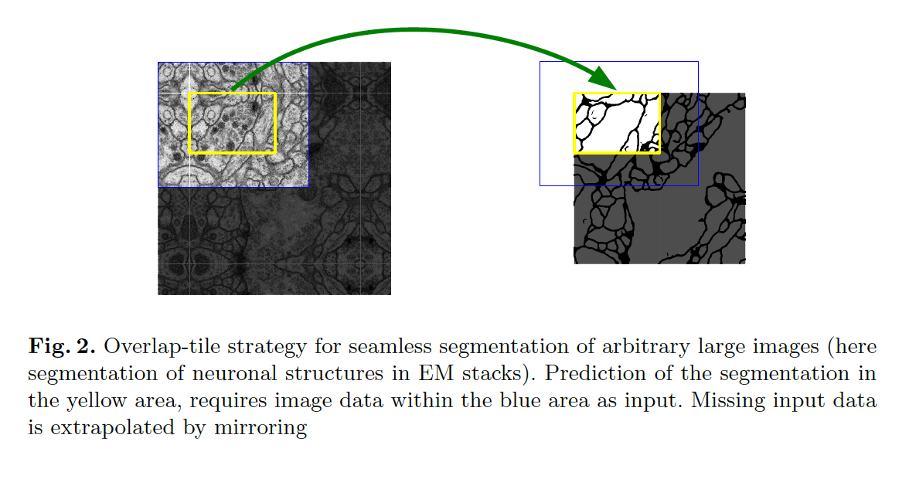
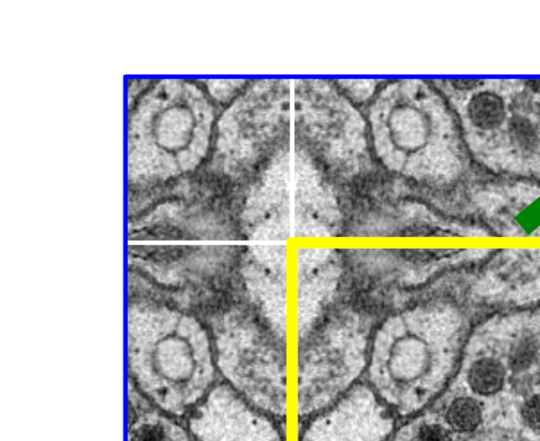
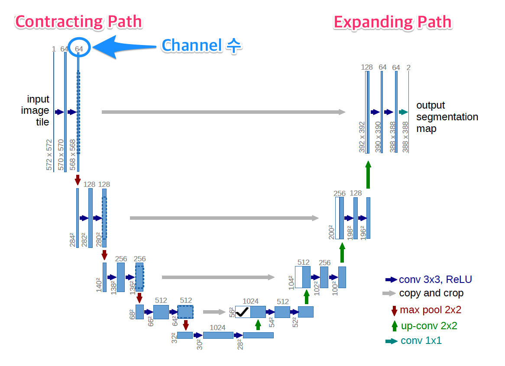
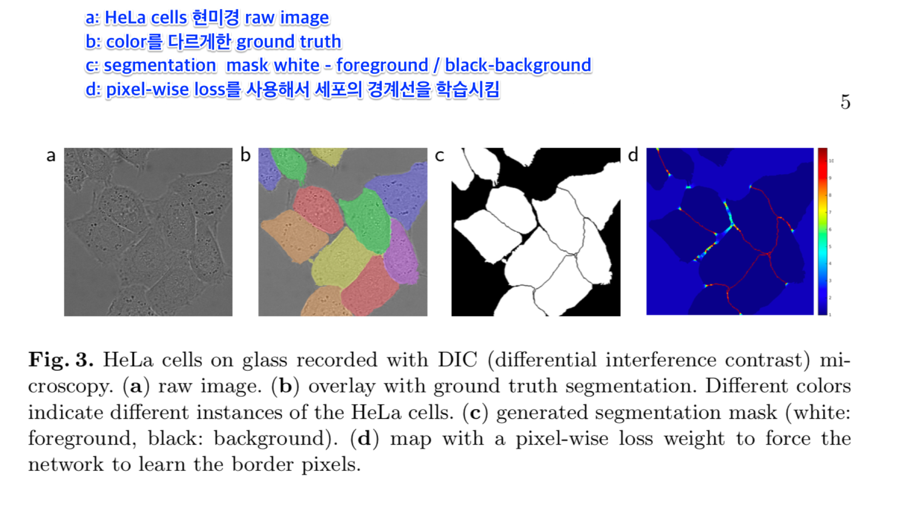
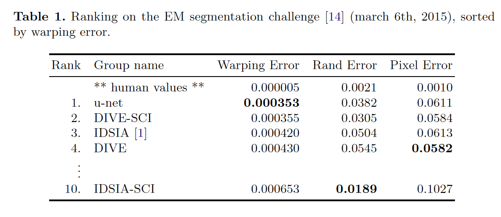

---

layout: post
current: post
cover:  assets/images/posts/2018-04-02-U_Net/u-net.png
navigation: True
title: U-Net
date: 2018-04-02 00:00:00
tags: [논문 리뷰]
class: post-template
subclass: 'post tag-papers'
author: eunsook_kang

---

논문 링크 : [U-Net: Convolutional Networks for Biomedical Image Segmentation](https://arxiv.org/pdf/1505.04597.pdf)

이번 블로그의 내용은 Semantic Segmentation의 가장 기본적으로 많이 쓰이는 모델인 U-Net에 대한 내용입니다.

U-Net의 이름은 그 자체로 모델의 형태가 U자로 되어 있어서 생긴 이름입니다. 

이번 블로그의 내용을 보시기 전에 앞전에 있는 [Fully Convolution for Semantic Segmentation](https://modulabs-biomedical.github.io/FCN) 과 
[Learning Deconvolution Network for Semantic Segmentation](https://modulabs-biomedical.github.io/Learning_Deconvolution_Network_for_Semantic_Segmentation) 을 읽고 보시면 더 도움이 되실 것 같습니다!

## Abstract

Abstract에서는 전체적인 U-Net의 핵심 구조, data augmentation, ISBI challenge에서 좋은 성능을 보였다는 이야기를 하고 있었습니다. 

Deep Network는 많은 양의 annotated된 학습 샘플을 가지고 성공적인 training을 해왔습니다. 

이 논문에서는 data augmentation을 잘 활용하여 annotated sample을 보다 효율적으로 사용하는 training 전략을 보여줍니다. 

논문에서 제안하는 아키텍쳐는 contracting path에서는 context를 캡쳐하고, 대칭적인 구조를 이루는 expanding path에서는 정교한 localization을 가능하게 하는 구조입니다.

## 1. Introduction

논문에서 처음에 소개하는 내용은 지난 2년동안 (U-Net은 2015년 5월에 발표되었습니다.) deep convolution network는 많은 visual recognition 작업에서 매우 좋은 성능을 보였지만, training set의 크기와 고려할 네트워크의 크기 때문에 그 성공은 제한적이었다고 말하고 있습니다. 

Convolution네트워크의 일반적인 용도는 이미지에 대한 출력이 단일 클래스 레이블인 분류 작업에 있지만, 
많은 시각 작업, 특히 biomedical processing에서 원하는 출력은 localization을 포함해야 하며, 즉 클래스 라벨은 각 pixel에 할당 되어야 한다고 합니다. 

U-Net에서 핵심으로 말하고 있는 내용은 세가지로 생각됩니다. 

1. Convolution Encoder에 해당하는 Contracting Path + Convolution Decoder에 해당하는 Expanding Path의 구조로 구성. (해당 구조는 Fully Convolution + Deconvolution 구조의 조합)
2. Expanding Path에서 Upsampling 할 때, 좀 더 정확한 Localization을 하기 위해서 Contracting Path의 Feature를 Copy and Crop하여 Concat 하는 구조. 
3. Data Augmentation

기존에는([Ciresan et al. [1]](http://people.idsia.ch/~juergen/nips2012.pdf)) Sliding-window을 하면서 로컬 영역(패치)을 입력으로 제공해서 각 픽셀의 클래스 레이블을 예측했지만, 이 방법은 2가지 단점으로 인해서 Fully Convolution Network구조를 제안하고 있습니다. 

두가지 단점은, 

1. 네트워크가 각 패치에 대해 개별적으로 실행되어야 하고 패치가 겹쳐 중복성이 많기 때문에 상당히 느리다.
2. localization과 context사이에는 trade-off가 있는데, 이는 큰 사이즈의 patches는 많은 max-pooling을 해야해서 localization의 정확도가 떨어질 수 있고, 반면 작은 사이즈의 patches는 협소한 context만을 볼 수 있기 때문입니다. 

Contracting Path에서 Pooling되기 전의 Feture들은 Upsampling 시에 Layer와 결합되어 고 해상도 output을 만들어 낼 수 있습니다. 

하나 더 중요한 점은! Upsampling시에 많은 수의 Feture Channels를 사용합니다. 
아래 네트워크 아키텍쳐를 보시면 64 채널부터 시작하여 1024까지 증가 되는것을 볼 수 있습니다. 

네트워크는 fully connected layers를 전혀 사용하지 않고, 각 layer에서 convolution만 사용합니다. 

다음으로, U-Net에서는 Segmentation시 overlab-tile 전략을 사용합니다. (그림.2)

이 전략은, 전체 U-Net 아키텍쳐에서 input[572X572] -> output[392X392] 로 Segmentation map이 만들어 질때, 위의 그림에서 보는 것과 같이 border부분에서 정보가 없는 빈 부분이 발생하게 되는데요.

이 부분을 채우기 위해서 0으로 채우거나, 주변의 값들로 채우거나 이런 방법이 아닌 Mirroring 방법으로 pixel의 값을 채워주는 방법 입니다. 

노랑색 영역이 실제 세그멘테이션 될 영역이고, 파랑색 부분이 Patch 입니다. 

그림을 확대해서 자세히 보시면, 거울처럼 반사되어 border부분이 채워진 것을 확인 할 수 있었습니다.  

Overlap-tile 이라는 이름은, 파랑색 부분이 Patch단위로 잘라서 세그멘테이션을 하게 되는데 (용어는, Patch == Tile) 이 부분이 아래 그림처럼 겹쳐서 뜯어내서 학습시키기 때문인 것 같습니다. 

## 2. Network Architecture

Contracting Path는 

1. 전형적인 Convolution network 이고, 
2. 두번의 3X3 convolution을 반복 수행하며 (unpadded convolution를 사용),  
3. ReLU를 사용합니다 
4. 2X2 max pooling 과 stride 2를 사용함
5. downsampling시에는 2배의 feture channel을 사용하고 

Expanding Path는

1. 2X2 convolution (up-convolution)을 사용하고, 
2. feature channel은 반으로 줄여 사용합니다. 
3. Contracting Path에서 Max-Pooling 되기 전의 feature map을 Crop 하여 Up-Convolution 할 때 concatenation을 합니다. 
4. 두번의 3X3 convolution 반복하며 
5. ReLU를 사용합니다

마지막 Final Layer에서는 1X1 convolution을 사용하여 2개의 클래스로 분류합니다. 

U-Net은 총 23개의 convolution layer가 사용됐습니다. 

## 3. Training

학습은 Stochastic gradient descent 로 구현되었습니다.

이 논문에서는 학습시에 GPU memory의 사용량을 최대화 시키기 위해서 batch size를 크게해서 학습시키는 것 보다 input tile 의 size를 크게 주는 방법을 사용하는데요, 
이 방법으로 Batch Size가 작기 때문에, 이를 보완하고자 momentum의 값을 0.99값을 줘서 과거의 값들을 더 많이 반영하게 하여 학습이 더 잘 되도록 하였습니다. 

#### softmax

#### Cross Entropy Loss with w(x)

각각 정답 픽셀에대한 cross entropy loss에는 $w(\mathbf x)$라는 가중치 값이 추가됩니다. 
여기서  $p_{l(x)}(x)$의 $l(x)$는 정답 클래스 즉 위 **softmax 수식**에서 정답의 레이블에 해당하는  $k$ 값을 반환하는 함수 입니다. 

cross entropy 함수는 정답의 추정값을 log에 사용하기 때문에 이에 해당하는 정답의 확률을 가져오는 것이죠. 
수식 (1)은 loss 값에 가중치 $w(\mathbf x)$를 곱한 형태이며 이제 우리가 살펴볼 것은 $w(\mathbf x)$입니다.

$w(\mathbf x)$ **구하는 법 :**

$w(\mathbf x)$는 두개의 텀의 합으로 구성됩니다. 

$w_c(\mathbf x)$는 $x$ 위치의 픽셀에 가중치를 부여하는 함수입니다. 

$w_c(\mathbf x)$는  $\mathbf x$ 의 위치에 해당하는 클래스의 빈도수에 따라 값이 결정됩니다. 
즉 학습데이터에서 $\mathbf x$ 픽셀이 background일 경우가 많은지 foreground일 경우가 많은지의 빈도수에 따라 결정된다고 보시면 됩니다. 
그 뒤의 exp 텀은 $d_1$, $d_2$ 함수를 포함하는데 $d_1$ 은 $\mathbf x$ 에서 가장 가까운 세포까지의 거리이고 $d_2$는 두번째로 가까운 세포까지의 거리를 계산하는 함수입니다. 
즉  $\mathbf x$는 세포사이에 존재하는 픽셀이며 두 세포사이의 간격이 좁을 수록 weight를 큰 값으로 두 세포 사이가 넓을 수록 weight를 작은 값으로 갖게 됩니다. 이는 그림 3(d) 를 보시면 명확하게 확인하실 수 있습니다. 

네트워크 파라미터의 초기화는 He 초기화 방법을 적용하였습니다. 

### 3.1 Data Augmentation

Data Augmentation은 3 by 3 elastic 변환 행렬을 통해 수행합니다. [영상변환 매트릭스](https://en.wikipedia.org/wiki/Transformation_matrix)는 클릭하셔서 위키의 내용을 참조하면 자세한 내용을 확인하실 수 있습니다. 세포를 세그멘테이션 하는 것이기 때문에 elastic deformation의 적용이 성능향상에 매우 큰 역할을 했다고 합니다.

## 4. Experiments

학습한 이후 성능 지표는 EM Segmentation challenge에서 wraping Error / Rand Error / Pixel Error로 1위를 한 지표를 볼 수 있었습니다. 

IOU(Intersection over union) 방법으로 측정한 결과로는 아래와 같이 92% / 77.5%로 가장 좋은 성능을 보인것을 확인 할 수 있었습니다. 

## 5. Conclusion

마지막으로 결론입니다. 

U-Net 구조는 매우 다른 biomedical segmentation applications에서 좋은 성능을 보였고, 
이 성능을 보일 수 있었던 것은 Elastic 변환을 적용한 data augmentation 덕분이고, 
이것은 annotated image가 별로 없는 상황에서 매우 합리적이었다고 합니다.  

학습하는데 걸렸던 시간은 NVidia Titan GPU(6GB)를 사용했을때, 10시간이었습니다. 

이 U-Net 구현은 Caffe 기반으로 제공되고 있으며, U-Net의 아키텍쳐는 다양한 task에서 쉽게 적용되서 사용될 것을 확신한다고 하면서 논문은 마무리 됩니다. 

Image Segmentation Task에서 가장 많이 쓰이는 U-Net은 U자형 아케텍쳐와 Fully Convolution & Deconvolution 구조를 가지고 있는 것으로 좀 더 정확한 Localization을 위해서 Contracting Path의 Feature를 Copy and Crop해서 Expanding Path와 Concat하여 Upsampling을 한다는 것을 확실하게 알아두면 좋을 것 같습니다. 

이상 부족하지만, U-Net 논문에 대한 포스팅을 마치겠습니다. 틀린 부분이 있거나 보충 내용이 있으시면 언제든지 말씀해 주시면 수정하도록 하겠습니다!

감사합니다.