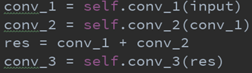
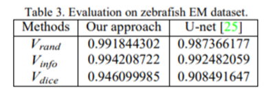
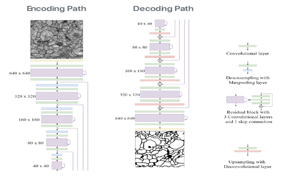
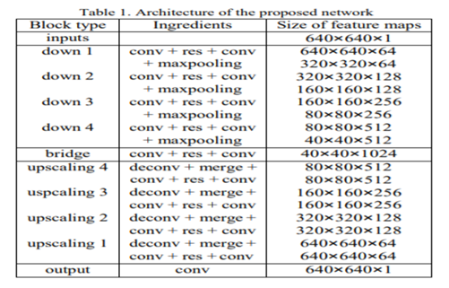

# **FusionNet**

FusionNet은 U-Net처럼 Semantic Segmentation에 활용 할 수 있는 모델입니다. 

이름이 FusionNet인 이유는 아마도 Encoder에 있는 Layer를 가져와 Decoder에 결합(Fusion)하는 방법이 이 모델에 가장 특징적인 부분이기 때문인 것 같습니다. 

U-Net과 유사한 부분이 많기 때문에 블로그에 U-Net글을 읽으시면 많은 도움이 될 것 같습니다. 
[U-Net (by 강은숙)](https://modulabs-biomedical.github.io/U_Net)

### FusionNet 이란?

**FusionNet**은 Connectomics(뇌신경 연결지도를 작성하고 분석하는 신경과학의 일종) 데이터에서 신경구조를 Segmentation 할 목적으로 만든 딥러닝 모델입니다.

논문발표일(2016.12.26) 기준에서 최신의 기술인 Semantic Segmentation과 Residual Neural Networks를 사용 한 모델이라고 하네요.

이 논문에서는 FusionNet을 Electron Microscopy (EM) 이미지에서 Cell Membrane과 Cell Body의 Segmentation에 적용하였습니다.

### 모델의 특징

이전에 connectomics에서 automatic image segmentation을 할 때 보통 **CNN(Convolutional Neural Network)**에 기반 한 **patch-based pixel-wise classification**을 사용했는데 EM 데이터가 용량이 상당히 크기 때문에 처리하기 위한 비용이 많이 들어간다는 문제가 있었습니다.

( 여기서 비용이란 딥러닝을 하기 위한 하드웨어 구입, 전기 사용, 시간 등을 말합니다. )

Encoding, Decoding을 사용한 **FCN(fully Convolution Neural Network)**계열의 모델의 경우 연산량을 줄일 수 있어 비용을 절감 할 수 있는데 이것에 대표적인 모델이 **U-Net**입니다.

하지만 **U-Net**의 방법이 데이터로부터 다중의 맥락 정보를 학습할 수 있지만 **Gradient Vanising** 문제가 발생하기 때문에 깊은 네트워크를 만드는 것은 제한적이었습니다.

**FusionNet**은 **residual layers**와 **summation-based skip connection**을 사용하여 **U-Net**의 단점을 보완한 모델입니다.

**residual layer**

> 이전에 계산된 값을 뒷부분에도 연결시켜서 모델이 깊어져도 값을 잊어버리지 않게 해주는 역할을 함 (vanishing gradient 문제 해결)

**summation-based skip connections**

>  층을 건너띄워서 연결, 건너띄워 넘어온 층과 이전의 층을 더해서(합계산) 뒤에 층으로 넘김

##### Pytorch Code 예시 (summation-based skip connections)

#### U-Net과 비교하여 가장 특징적인 차이

**U-net**에서는 긴 skip connection을 통해 feature map을 **이어 붙임 (Concatenating)** 
**FusionNet**에서는 긴 skip connection을 통해 feature map의 **값을 더함** + 짧은 skip connection도 encoding, decoding의 각 step에서 사용

이 방법이 실제로 좋은 퍼포먼스를 보여서 **ISBI 2012 EM segmentation challenge**에서 **1등** 했다고 합니다.
(물론 FusionNet이 100% 기여했다고 까지는 볼 수 없을 것 같습니다.) 

OverFitting 해결을 위한 **Data enrichment** (이미지 데이터에 다양한 변형을 가하거나 노이즈를 추가하는 등의 방법을 사용)를 사용 한 것도 좋은 퍼포먼스를 내는데 도움이 되었을 것 입니다.

정말 U-Net보다 결과가 좋네요!!!

### 모델 아키텍처

**Encoding Path**	->	640X640부터 40X40 까지 the features of interest를 검출

**Decoding Path**	->	40X40부터 640X640까지 synthesis를 예측

**녹색 블록**	->	regular convolutional layer, ReLu 활성함수, batch normalization으로 구성

**보라색 블록**	->	3개의 convolutional block으로 구성되는데 마지막 블록3에는 블록1이 블록2와 skip해서 더해진 residual layer가 연결 됨 

**파란색 블록**	->	maxpooling layer로써 encoding path에서 feature 압축을 위한 downsampling을 하기 위해 사용

**빨간색 블록**	->	deconvolutional layer로 decoding path에서 interpolation을 사용한 upsampling을 하기 위해 사용

### 참고자료

[FusionNet : A deep fully residual convolutional neural network for image segmentation in connectomics](https://arxiv.org/ftp/arxiv/papers/1612/1612.05360.pdf)

이상으로 FusionNet에 대한 글을 마칩니다. 수정해야 할 내용이 있다면 꼭 말씀 부탁드립니다.
부족한 글이지만 끝까지 읽어주셔서 감사합니다!!!
