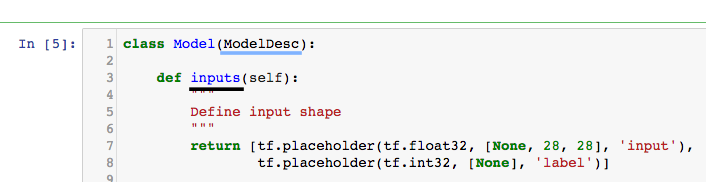
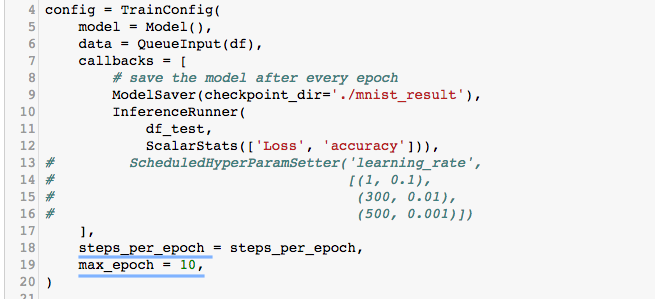

# Tensorpack 구조 이해하기

##### ModelDesc와 Trainer를 중심으로

### Peter Cha

## Tensorpack을 공부하면, &#128528;

* 우선 모르는 것들 투성이다. 알고나면 너무 쓰기 편하지만, 처음 접할 때는 너무 많이 추상화 된 API에 '이게 tensorflow는 맞는지..'할 정도니까.
* 우선 이 튜토리얼을 보기 전, 필자의 [`tensorpack_tutorial.ipynb`](https://github.com/PeterCha90/Tensorflow-Deep-Learning/blob/master/Tensorpack_tutorial.ipynb)를 먼저 보길 바란다. 대략적인 dataflow는 데이터를 불러오는 부분으로 이해를 마쳤다고 생각하고, dataflow부분은 생략하고 설명을 진행하도록 하겠다. 
* 이번에는 Model의 선언하게 될 때 상속받은 **`ModelDesc`** class와, 학습을 실행하는 Trainer들의 모태가 되는 **`TowerTrainer`** 에 대해 알아보고자 한다.`tensorpack_tutorial.ipynb`에서 설명에 해당하는 부분을 함께 찾아보면 이해에 도움이 더 될 것 같다. 
* 이 Tutorial은 Tensorpack [documentation](https://tensorpack.readthedocs.io/modules/train.html?highlight=TowerFuncWrapper)을 참고해서 만들었다. 

<br>

## 1. Class `ModelDescBase` &#128527;

> Base class for a model description이다.
* `ModelDesc`는 ModelDescBase를 기반으로 만들어졌기 때문에, `ModelDescBase`를 먼저 설명한다. 

### 1.1. build_graph(*args)

* 모든 symbolic graph (**Model의 형태**)를 Build한다. 이 함수가 뒤에서 설명할 `TowerTrainer`에서 `tower function`의 일부분이다.
* 그 다음 설명할 `inputs()`에서 정의된 input list에 맞는 `tf.Tensor`를 parameter로 받는다. 
* 아무것도 리턴하지 않는다. 


### 1.2. inputs()

* Model에서 input으로 받을 텐서들의 placeholder들을 정의하는 함수다. 
* 후에 `InputDesc`로 변환될, `tf.placeholder`들을 return 한다.



### 1.3. get_inputs_desc

* 이름에서 알 수 있듯이, inputs()에서 정의된 모양대로 생긴 InputDesc를 list로 반환하는 함수다. 

<br>

## 2. Class `ModelDesc` &#128526;

* **주의사항**: **build_graph()를 꼭 cost를 return하도록** 코딩해야 한다.
* 앞에서 설명한 ModelDescBase를 상속받은 터라, 위의 3가지는 함수는 내장하고 있다. 
### 2.1. optimizer()
 * `tf.train.Optimizer`를 여기에 선언해주고 Return하게끔 함수를 짜준다. 
### 2.2. get_optimizer()
* optimizer()를 호출하면, 계속 새로 optimizer를 만들어서 생성하는데, 이 함수를 쓰면 이미 optimizer()를 통해 생긴 optimizer를 기록해 놓았다가 반환시켜준다. 


<br>

## 3. Class `TowerTrainer` &#128566;

### Tensorpack에서는,

* 우리가 흔히 말하는 Model을 계속 Tower라고 지칭한다.(왜 그런지 모르겠다. &#128566;)
* 그래서 아래에서 나오는 `TowerTrainer`는 만든 모델을 학습을 시키는 **Trainer**고, 그 트레이너가 어떤 특징들을 가진 함수들을 들고 다니는지 생각하면 이해가 쉽다. 
* 기본적으로 Tensorpack에 나오는 모든 Trainer들은 `TowerTrainer`의 subclass다 이 개념이 그래서 궁극적으로는 모든 neural-network training을 가능하게 해준다.

### 3.1. `get_predictor`(input_names, output_names, device=0)


> Returns a callable predictor built under `TowerContext(is_training=False)`. 

* 이 함수가 호출되면, 가지고 있는 TowerContext(모델의 Train or Test 여부)를 <u>training mode가 아닌 상태(is_training=False, 즉=Test 모드)</u>로 돌려준다. 그러니까 **Test data로 시험할 때만 부르는 함수**. 그래서 이름도 predictor.
* **`Parameters`**: `input_names` **(list)**, `output_names` **(list)**, `device` **(int)** – build the predictor on device ‘/gpu:{device}’ or use -1 for ‘/cpu:0’.
* 파라미터로 들어가는 input, output이름은 모델 안에서 선언된 이름이 아니면 안 돌아가니까 조심.


### 3.2. inputs_desc
> Returns – list[InputDesc]: metainfo about the inputs to the tower.

* 말 그대로, 모델에 들어갈 Input의 크기와 같은 정보가 들어있는 list를 반환해준다. 

### 3.3. tower_func
> Build Model.
* 이 친구가 실제 **모델을 정의하고, Build**할 수 있는 함수를 세팅하는 부분!
* **`ModelDesc`** interface로 정의된 model을 trainer로 돌려야 하는 상황이 자주 발생할 수 있는데, 이 때, <u>ModelDesc에서 선언된 **build_graph 함수**가 이 역할을 대신</u>해 줄 수 있다.

### 3.4. towers
> Returns – a TowerTensorHandles object, to
> access the tower handles by either indices or names.
* 모델 및 Train 전반에 걸쳐 관련된 변수들에 접근하고 싶을 때 사용한다! 그래서 이 함수는 Transfer learning을 할 때 유용할 거 같다.
* 이미 **모델 그래프가 Set up이 끝난 뒤에만** 이 함수는 호출될 수 있다. 
* 각각의 `layer`와 `attributes`에 이 `towers`함수를 호출하면 접근할 수 있게 된다! 아래는 예시.

```
# Access the conv1/output tensor in the first training tower
trainer.towers.training()[0].get_tensor('conv1/output')
```

<br>

## 4. Class `Trainer` &#128580;

>  Base class for a trainer.


- 분명히 위에서 금방, 

> "기본적으로 Tensorpack에 나오는 모든 Trainer들은 `TowerTrainer`의 subclass다"

라고 했는데, 이 `TowerTrainer가 상속을 받는 class`가 있었으니, 이름하여 TowerTrainer보다 더 단순한 **`Trainer`** 다.

* 다른 TowerTrainer를 상속 받은 Trainer들을 사용할 때, 종종 TowerTrainer에서 본 적 없는 친구들이 나타나는데, 그 친구들이 Trainer의 것인 경우가 있다. 
* 하지만, Trainer 고유 함수나 요소에 직접적으로 접근할 일이 별로 없어서 아래의 3가지 정도만 알고 있으면 될 것 같다. 나머지는 [문서](https://tensorpack.readthedocs.io/modules/train.html?highlight=register_callback#tensorpack.train.Trainer)를 참고하자. 


> 아래 1, 2번의 max_epoch과, steps_per_epoch은 `TrainConfig`에서 자주 만나는 키워드들인데, 이 친구들이 Trainer의 요소였다.

### 4.1. max_epoch
* Epoch은 몇 번 돌릴 것인지

### 4.2. steps_per_epoch

* 한 에폭당 steps은 총 몇 번인지.




### 4.3. register_callback(cb)
> Register callbacks to the trainer. It can only be called before Trainer.train().
* <u>Trainer가 모델을 돌릴 때마다(epoch이 진행 됨에 따라), 수행하게 될 부가적인 기능</u>들을 Tensorpack에서는 **callback**이라고 부르고, 대표적인 callback으로 **ModelSaver()** 가 있다.
* 이 Callback을 명시적으로 전달하여 Trainer Object에 세팅할 수 있는 기능이다. 주로 모델을 튜닝할 때, 설정하면서 종종 쓰는 것을 코드 상에서 확인할 수 있다. 

<br>


## 5. TowerContext &#128539;

 * **`TowerContext`** 는 Training과 Validation 혹은 Test시에 동작이 달라야 하는 `BatchNorm`이나, `Dropout`을 제어하기 위해서 만들어진 function이다. 
 * `tensorpack_tutorial.ipynb`에서는 이 친구를 찾아볼 수 없는데, SimpleTrainer 소스코드를 보니, 자체적으로 안에서 train/test time에 맞춰서 TrainTowerContext라는 것으로 조절하고 있기 때문이었다. 
 * 사용법은 간단하다. 
> ```
> training
> with TowerContext('', is_training=True):
>   # call any tensorpack layer
>
> test
> with TowerContext('name or empty', is_training=False):
>   # build the graph again
> ```


- 그래서, 내가 세운 모델을 외부에서 사용하고 싶을 때, 즉, 나만의 Trainer를 새로 정의해서 train/test time때, 다르게 동작을 해야하는 상황이라면, TowerContext를 적절히 써서 분기시켜줘야 한다. 
- 아래는 Tensorpack Github에서 제공하는 [GANTrainer](https://github.com/tensorpack/tensorpack/blob/master/examples/GAN/GAN.py)에서 실제로 TowerContext를 어떻게 설정해주는지 보여주는 예시다. 

> ```python
> class GANTrainer(TowerTrainer):
>     def __init__(self, input, model):
>     ..
>     ...
>     
>     # Build the graph
>         self.tower_func = TowerFuncWrapper(model.build_graph, inputs_desc)
>         with TowerContext('', is_training=True):
>             self.tower_func(*input.get_input_tensors())
>         opt = model.get_optimizer()
>     ... 
> ```


## Thank you &#128583;